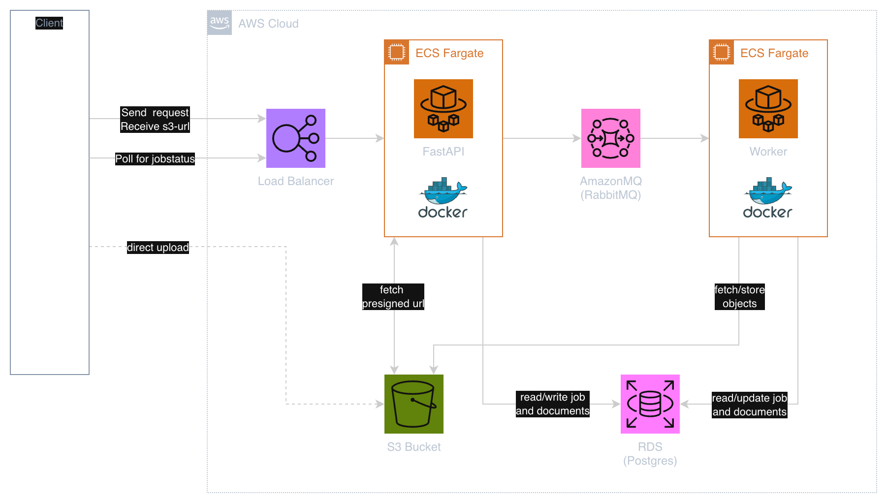

# Event-Driven Document Ingestion Pipeline

An async PDF-to-Markdown processing pipeline built for agentic systems — converts user-uploaded PDFs into structured Markdown for LLM consumption. The focus is the infrastructure and pipeline supporting the conversion, not the parsing technology itself.

Deployed end-to-end on AWS with CDK-managed infrastructure. The failure modes it handles — message redelivery, worker crashes, queue saturation — are the same ones that surface in any async pipeline at scale. The patterns transfer directly to any event-driven workload, regardless of what the workers are actually doing.

---

## Architecture



---

## Design Decisions

### Queue-depth backpressure

Before creating a job, the API queries the broker for the current queue depth. If it's at or above the threshold, the request is rejected with 429 immediately — no Job record is created. This acts on actual consumer lag rather than a per-client counter, so it reflects real system pressure. Traditional rate limiting wouldn't prevent a burst of legitimate clients from saturating the workers.

### Atomic status gate to prevent duplicate job execution

The worker commits the `STARTED` transition in its own isolated session before any processing begins. A concurrent redelivery of the same message loads the job, sees the status is no longer `QUEUED`, and ack-drops without doing any work. The early, separate commit is what makes this safe — if the status change were bundled into the processing transaction, a mid-process crash would leave the job `QUEUED` and two concurrent redeliveries could both race past the check.

For the narrow window between the initial status check and the `STARTED` write, the update uses a compare-and-swap guard (`expected_status=QUEUED`). If two workers somehow both pass the check, only one lands the write — the other gets a `JobStateConflictException` and ack-drops.

### At-least-once delivery with idempotent consumers

RabbitMQ guarantees at-least-once delivery: after a crash, unacked messages are redelivered. The consumer is designed around this. Every message handler checks job status before claiming the job and ack-drops if status isn't `QUEUED`. The result is at-most-once execution despite at-least-once delivery — redeliveries are always safe.

### DB-managed retry with terminal failure semantics

On any processing exception, the consumer catches it and decides purely from DB state: if `attempts < max_attempts`, the job is reset to `QUEUED` and explicitly re-enqueued; if exhausted, it's marked `FAILED` and nothing touches it again. The message is always `ack`ed on failure — re-delivery is never used for retry. The broker carries no retry logic; the DB is the single source of truth. `FAILED` is terminal.

### Serial consumer model for CPU-bound workloads

`prefetch_count=1` means RabbitMQ delivers at most one message at a time per consumer channel. PDF parsing is CPU-bound and GIL-limited, so in-process concurrency wouldn't increase throughput — it would just interleave work on a single core. Each worker processes one job at a time; throughput scales by running more workers, not more goroutines.

### Graceful shutdown with in-flight drain

`SIGTERM`/`SIGINT` set an `asyncio.Event`. The consume loop checks the flag before pulling the next message. The active task is wrapped in `asyncio.shield()` so cancellation doesn't interrupt it mid-flight. The worker finishes the current job, acks, then closes the channel and connection cleanly. `SIGKILL` is safe as a last resort because of the idempotency gate — the redelivered message will be ack-dropped.

### Full lifecycle tracing

Every job records `queued_at`, `started_at`, `completed_at`, and `failed_at`. This enables direct observability queries without any external tracing infrastructure:

- Queue delay: `started_at - queued_at`
- Processing latency: `completed_at - started_at`
- Failure rate: jobs where `failed_at IS NOT NULL`
- Retry pressure: `attempts / max_attempts`

---

## Request Flow

### Happy path

```
1. POST /documents
   → validates API key
   → creates Document record (stores object key, not the file)
   → returns presigned S3 PUT URL

2. PUT <presigned_url>
   → client uploads PDF directly to S3
   → API never handles the bytes

3. POST /documents/{id}/process
   → confirms document exists and has been uploaded (S3 object_exists check)
   → checks queue depth — rejects 429 if at capacity
   → creates Job record (status: QUEUED)
   → commits Job to DB
   → enqueues {job_id} to RabbitMQ

4. Worker receives message
   → loads job from DB, ack-drops if status != QUEUED
   → commits STARTED in isolated session
   → fetches PDF bytes from S3
   → parses with PyMuPDF4LLM → Markdown string
   → uploads Markdown to S3
   → creates Artifact record in DB
   → marks job COMPLETED
   → acks message

5. GET /jobs/{id}
   → returns job status, timestamps, error message if any

6. GET /documents/{id}/artifacts
   → returns presigned S3 GET URLs for each output artifact
```

### Edge cases

**Queue at capacity**
`POST /documents/{id}/process` returns 429. The depth check queries the broker directly, so it reflects real consumer lag. No Job record is written. The client should retry with backoff.

**Document not yet uploaded**
`POST /documents/{id}/process` checks `object_exists` in S3 before writing anything. Returns 409 if the upload hasn't landed yet. Prevents jobs from being queued for files that don't exist.

**Message redelivery after worker crash**
RabbitMQ redelivers unacked messages when the consumer reconnects. The next worker to receive the message loads the job from DB. If status is `STARTED` or `COMPLETED`, it acks and drops — no reprocessing. The early `STARTED` commit (its own session, before any processing work) is what ensures the status is visible to the redelivery.

**Processing failure (S3 error, parse error, DB error)**
Any exception during processing is caught in `_handle_failure`. If `attempts < max_attempts`: job is reset to `QUEUED`, explicitly re-enqueued, message acked. If `attempts == max_attempts`: job is marked `FAILED` (terminal), message acked. Re-delivery via the broker is never used for retry — requeue is always explicit and DB-driven.

**DB unavailable at STARTED commit**
`DatabaseException` → `nack(requeue=True)`. The job stays `QUEUED` in the DB. RabbitMQ redelivers to the next available worker.

**Poison message**
Malformed JSON or missing `job_id` is caught immediately, logged, and acked. A structurally broken message can't be fixed by redelivery and should never block the queue.

---

## Local Dev

**Prerequisites:** Docker, AWS credentials (S3 uses real AWS even locally)

```bash
cp .env.example .env  # fill in AWS_ACCESS_KEY_ID, AWS_SECRET_ACCESS_KEY, S3_BUCKET
docker compose up
```

| Service             | Address                    |
| ------------------- | -------------------------- |
| API                 | http://localhost:8080      |
| API docs            | http://localhost:8080/docs |
| RabbitMQ management | http://localhost:15672     |

All requests require an `X-API-Key` header. Alembic migrations run automatically on API startup.

---

## Stack

- **API** — FastAPI + uvicorn on ECS Fargate, behind an ALB
- **Worker** — aio_pika consumer on ECS Fargate, PyMuPDF4LLM for local PDF parsing
- **Queue** — Amazon MQ (RabbitMQ)
- **Database** — RDS PostgreSQL, SQLAlchemy 2.x, Alembic
- **Storage** — S3 (raw PDFs + Markdown artifacts)
- **Infrastructure** — AWS CDK, Docker Compose for local dev
